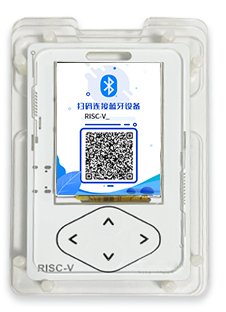

# E_Card
Open source application based on RISC-V MCU CH32V208 electronic card
# 1.简介

在最近举办的RISC-V中国峰会2022南京分会上，沁恒微电子给每个来到现场的参会者们发放了一个电子胸牌"E_Card"。以展示参会者的基本信息，同时向参会者展示大会总议程、当前正在进行议程等信息，并实现抽奖、投票等现场互动操作。

  

## 1.1 功能

- 微信小程序配置用户信息；
- 同步RTC时钟；
- 触摸按键切换页面；
- home页面展示用户姓名、时间、电池电量等信息
- 通过沁恒微电子推出的轻量无线组网协议LWNS，搭配网关实现现场互动，包括推送当前正在进行的议程提示、抽奖、投票等。

## 1.2 特点

1. 主控采用搭配自研内核V4C的无线型微控制器[CH32V208](https://www.wch.cn/products/CH32V208.html)，最高144MHz系统主频，64KB SRAM，128KB Flash;
2. 显示采用2.0’320x240 IPS屏;
3. 外置W25Q64存储UI素材；
4. 搭配500mAh可充电锂电池；

## 1.3 项目中目录介绍

**software:** 该目录包含E_Card所有的软件代码主要内容如下所示：

- **Drivers:** 本项目用到的外设驱动或外设相关功能实现的代码（debug组件、BLE、LCD、外置Flash、片内Flash操作、二维码生成、USBCDC模拟COM口）；
- **HAL:** 硬件相关文件  ；
- **LIB:** 库文件（低功耗蓝牙协议栈：wchble.a、轻量无线组网协议栈：WCHLWNS.a）；
- **Soc:** 芯片内核相关文件；
- **Src:** 源文件（基本上只放main.c）
- **Startup:** 启动文件；
- **StdPeriphDriver:** 基本外设驱动源文件及头文件;

**hardware:** 该目录包含E_Card原理图；

**tools:** 外置Flash中数据生成下载相关的工具。

# 2.软件开发

本项目IDE采用[MounRiver Studio](http://www.mounriver.com/)进行开发，目录**software**下的工程可直接用**MounRiver**打开，编译出的hex文件通过[WCHISPTool](https://www.wch.cn/downloads/WCHISPTool_Setup_exe.html)下载到板子上。
